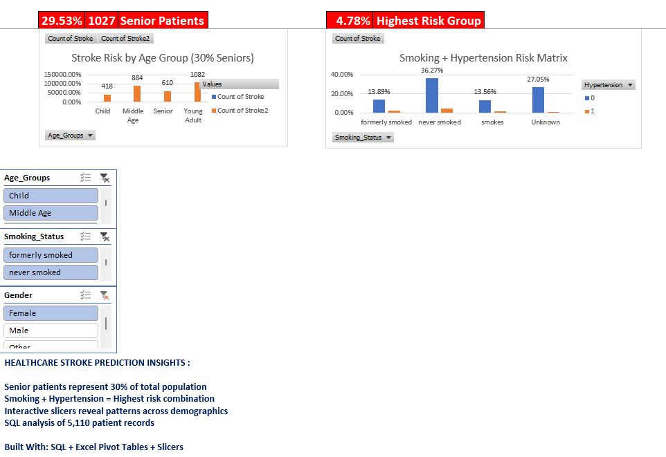

# Healthcare Stroke Prediction Dashboard (SQL + Excel)

This project analyzes stroke risk patterns using a healthcare dataset of **5,110 patient records**.
The analysis was performed using **SQL for data querying** and **Microsoft Excel (Pivot Tables + Slicers)** for dashboard creation.

---

## Objective:
To explore stroke occurrence patterns across different demographic and health factors and present insights through an interactive Excel dashboard.

---

## Tools Used:

- MySQL (Data aggregation & analysis queries)
- Microsoft Excel
  - Pivot Tables
  - Pivot Charts
  - Slicers
  - KPI Calculations

---

## Dataset Overview:

- Total Records: 5,110 patients
- Target Variable: `stroke` (0 = No Stroke, 1 = Stroke)
- Key Features Used:
  - Age
  - Gender
  - Smoking Status
  - Hypertension
  - BMI
  - Glucose Level

---

## Analysis Performed:

### Stroke Distribution by Age Group

- Created Age Groups (Child, Middle Age, Senior, Young Adult)
- Calculated total patients and stroke cases per group
- Computed stroke rate percentage

### Smoking + Hypertension Risk Matrix

- Analyzed stroke occurrence by smoking status
- Compared risk across hypertension categories
- Identified highest risk combination

### KPI Metrics Displayed

- Stroke Rate %
- Total Senior Patients
- Highest Risk Group %

### Interactive Filtering

- Added slicers for:
  - Age Group
  - Smoking Status
  - Gender
- Enabled dynamic dashboard updates

---

## Key Insights:

- Senior patients represent approximately 30% of the total population.
- Smoking combined with hypertension shows the highest stroke risk.
- Stroke distribution varies significantly across age groups.
- Interactive slicers allow demographic-based analysis.

---

## Dashboard Preview:



---

## What This Project Demonstrates:

- SQL aggregation and grouping queries
- Risk percentage calculation
- Pivot-based data analysis
- Dashboard structuring and KPI reporting
- Data storytelling using Excel

---
## Repository Structure:

```
Healthcare-Stroke-Prediction-Dashboard
│
├── data
│   ├── raw
│   │   └── Raw_Data.csv
│   │
│   └── processed
│       └── Raw_Data_Cleaned.xlsx
│
├── sql
│   ├── 01_age_analysis.sql
│   ├── 02_heart_analysis.sql
│   └── 03_risk_combos.sql
│
├── dashboard
│   ├── Healthcare_Stroke_Dashboard.xlsx
│   └── dashboard_Preview.png
│
└── README.md
```

## Conclusion:

This project demonstrates how healthcare data can be analyzed using SQL and visualized through Excel dashboards to identify stroke risk patterns across demographic and health-related factors.

---

## Author:

**Pranav Deshmukh**  
 Data Analyst  


